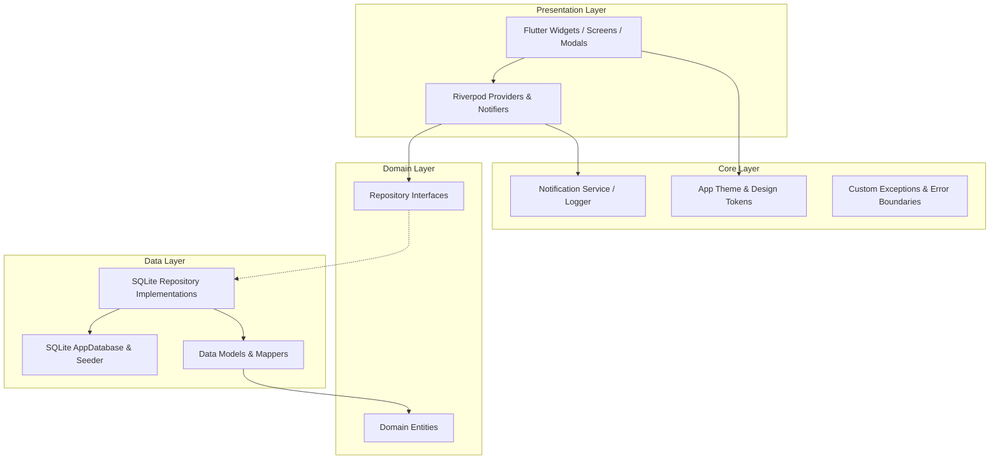
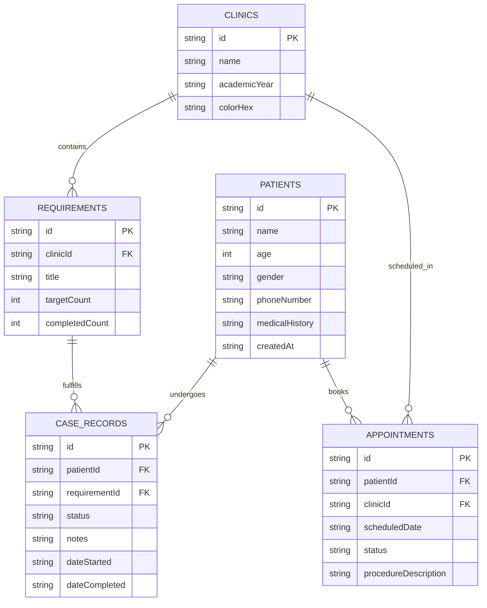

<div align="center">

  

  # Dentera (دنتيرا)
  ### The Offline-First Clinical Assistant & Requirements Tracker for Dental Students

  [](https://flutter.dev)
  [](https://dart.dev)
  [](https://sqlite.org)
  [](#-testing--quality-assurance)
  [](#-getting-started)
  [](#-why-dentera)

  <p align="center">
    <strong>Dentera</strong> is a dedicated mobile clinical assistant engineered specifically for dental students and clinical trainees. It streamlines daily patient management, dental department clinical requirement quotas, procedure logs, and appointment scheduling — completely offline without relying on external cloud servers or internet access.
  </p>

</div>

---

## 📑 Table of Contents

- [Overview](#-overview)
- [Why Dentera?](#-why-dentera)
- [Key Features](#-key-features)
  - [Clinical Quota & Requirement Tracking](#1-clinical-quota--requirement-tracking)
  - [Patient Registry & Case Records](#2-patient-registry--case-records)
  - [Smart Appointment Scheduling](#3-smart-appointment-scheduling)
  - [Data Portability & Backup](#4-data-portability--backup)
  - [Adaptive Clinical UI & Dark Mode](#5-adaptive-clinical-ui--dark-mode)
- [Architecture & Tech Stack](#-architecture--tech-stack)
- [Database Schema](#-database-schema)
- [Project Structure](#-project-structure)
- [Getting Started](#-getting-started)
  - [Prerequisites](#prerequisites)
  - [Installation](#installation)
  - [Running the App](#running-the-app)
- [Testing & Quality Assurance](#-testing--quality-assurance)
- [Roadmap](#-roadmap)
- [Contributing](#-contributing)
- [License](#-license)
- [Author](#-author)

---

## 💡 Overview

Dental school clinical rotations demand strict attention to clinical quotas, procedure deadlines, multi-step case sheets, and patient appointments. Student clinics are often located in hospital basements with poor cellular signal, making cloud-only solutions unreliable. Furthermore, handling patient records demands high ethical standards and data privacy.

**Dentera** solves these hurdles by providing a high-performance, **100% on-device** clinical management system that guarantees:
- **Zero latency & full offline availability:** Every action executes instantly against a local SQLite engine.
- **Strict patient confidentiality:** Patient records, medical alerts, and phone numbers never leave the physical device.
- **Effortless requirement tracking:** Know exactly how many root canals, restorations, extractions, or complete dentures you need to graduate.

---

## 🚀 Why Dentera?

| Challenge in Dental School | How Dentera Solves It |
|---|---|
| **Fragmented paper logbooks** | Centralized digital tracking for all procedures and clinic departments. |
| **No internet in hospital basements** | 100% offline-first architecture powered by SQLite and local storage. |
| **Unmet clinical graduation quotas** | Visual progress indicators displaying target vs. completed procedures. |
| **Forgotten patient follow-ups** | On-device local push notifications and timeline calendar scheduling. |
| **Patient data privacy concerns** | Zero third-party telemetry, zero external APIs, full local backup export. |

---

## ✨ Key Features

### 1. Clinical Quota & Requirement Tracking
- **Departmental Segregation:** Tracks procedures across core dental specialties:
  - 🦷 **Operative Dentistry** (Class I, II, III, IV, V Restorations, Composite & Amalgam)
  - 🔬 **Endodontics** (Anterior, Premolar, and Molar Root Canal Treatments)
  - 👄 **Prosthodontics** (Complete Dentures, RPDs, Crowns & Bridges)
  - 🪥 **Periodontics** (Scaling & Root Planing, Gingival Assessments)
  - 💉 **Oral & Maxillofacial Surgery** (Simple & Surgical Extractions, Suturing)
  - 🧸 **Pediatric Dentistry** (Pulpotomies, Space Maintainers)
  - 📐 **Orthodontics** (Cephalometric Tracing, Diagnostic Casts)
- **Live Progress Visualization:** Interactive circular rings and linear progress bars showing completion percentage for each requirement and clinic.

### 2. Patient Registry & Case Records
- **Fast Search & Filter:** Instant search by patient name or phone number, with category filtering and sorting.
- **Medical & Dental Alerts:** Highlight critical medical history (allergies, diabetes, hypertension, bleeding disorders) right on patient cards.
- **Case Sheets:** Attach procedures to specific requirements with starting dates, completion dates, and clinical notes.
- **Relational Integrity:** Foreign keys with `ON DELETE CASCADE` prevent orphaned records when removing patients or clinics.

### 3. Smart Appointment Scheduling
- **Timeline Strip:** Date selector strip for browsing daily clinic schedules.
- **Conflict Prevention:** Built-in form validations prevent scheduling in past dates or invalid timeslots.
- **Local Push Notifications:** Scheduled on-device alerts notify you ahead of time about upcoming patient sessions using `flutter_local_notifications` and `timezone`.

### 4. Data Portability & Backup
- **Full Database Export:** Export the entire SQLite database (`.db`) file with one tap to your preferred cloud drive, email, or messaging app using `share_plus`.
- **Database Import & Restore:** Easily restore your complete dataset onto a new device via `file_picker`.
- **Danger Zone / Reset:** Protected factory reset option with confirmation modal for clean-slate re-initialization.

### 5. Adaptive Clinical UI & Dark Mode
- **Ergonomic Palette:** Soft healthcare-inspired teals, blues, and slate tones designed to reduce eye strain under clinical lighting.
- **Theme Persistence:** Seamless toggle between Light and Dark mode, saved locally via `shared_preferences`.
- **Zero-State Graphics & Feedback:** Empty-state illustrations and floating notification snackbars for all user actions.

---

## 🏗️ Architecture & Tech Stack

Dentera adheres to **Clean Architecture** with a strict feature-first layering pattern:



### Core Technologies

- **Framework:** [Flutter](https://flutter.dev) (Dart 3.x)
- **State Management:** [Flutter Riverpod](https://pub.dev/packages/flutter_riverpod) (StateNotifier & AsyncNotifier)
- **Local Database:** [sqflite](https://pub.dev/packages/sqflite) (SQLite with PRAGMA foreign keys)
- **Preferences:** [shared_preferences](https://pub.dev/packages/shared_preferences)
- **Notifications:** [flutter_local_notifications](https://pub.dev/packages/flutter_local_notifications) & [timezone](https://pub.dev/packages/timezone)
- **File & Share Operations:** [file_picker](https://pub.dev/packages/file_picker) & [share_plus](https://pub.dev/packages/share_plus)
- **Typography:** [google_fonts](https://pub.dev/packages/google_fonts) (Inter)
- **Icons & Vector:** [flutter_svg](https://pub.dev/packages/flutter_svg) & Cupertino / Material Icons

---

## 🗄️ Database Schema

Dentera utilizes a relational SQLite schema designed for integrity and cascade operations:



---

## 📁 Project Structure

```text
dentera/
├── assets/
│   ├── icons/                  # SVG and vector assets
│   └── images/                 # App logo and graphics
├── lib/
│   ├── core/                   # Application-wide singletons and utilities
│   │   ├── constants/          # Academic years, universities, layout constants
│   │   ├── error/              # Failure models and custom exceptions
│   │   ├── logging/            # Riverpod ProviderObserver & structured logger
│   │   ├── services/           # Local notification service & scheduler
│   │   └── theme/              # Color schemes, typography, and ThemeData
│   ├── data/                   # Data layer
│   │   ├── database/           # SQLite setup, seeder, export & import helpers
│   │   ├── models/             # Data transfer models & JSON/Map mappers
│   │   └── repositories/       # Concrete SQLite repository implementations
│   ├── domain/                 # Domain layer (business logic & contracts)
│   │   ├── entities/           # Immutable domain entities
│   │   └── repositories/       # Abstract repository interfaces
│   ├── presentation/           # Presentation layer
│   │   ├── screens/            # Core screens (Dashboard, Clinics, Patients, Appointments, Profile, Onboarding)
│   │   ├── state/              # Riverpod state providers and controllers
│   │   └── widgets/            # Reusable UI components (cards, buttons, inputs, modals, progress)
│   └── main.dart               # App entrypoint and root widget
└── test/                       # Comprehensive unit and widget test suite (186+ tests)
```

---

## 🚦 Getting Started

### Prerequisites

- [Flutter SDK](https://docs.flutter.dev/get-started/install) (version `3.13.0` or higher)
- [Dart SDK](https://dart.dev/get-dart) (version `3.0.0` or higher)
- Android Studio / Xcode / VS Code with Flutter extension
- A connected physical device or emulator/simulator

### Installation

1. **Clone the repository:**
   ```bash
   git clone https://github.com/ShehabShaef/dentera.git
   cd dentera
   ```

2. **Install project dependencies:**
   ```bash
   flutter pub get
   ```

3. **Verify Flutter environment:**
   ```bash
   flutter doctor
   ```

### Running the App

Run on your connected device or simulator:

```bash
flutter run
```

For release mode performance testing:
```bash
flutter run --release
```

---

## 🧪 Testing & Quality Assurance

Dentera emphasizes rock-solid stability and zero regressions. The repository contains a comprehensive suite of **186+ unit, widget, and state integration tests**:

```bash
flutter test
```

### Test Coverage Highlights:
- **Database & Repositories:** Foreign key cascade verification, CRUD operations, transaction safety, export/import validation.
- **State Notifiers:** Async value transitions, filter logic, sort comparators, requirement quota increment/decrement.
- **UI & Modals:** Form validation (rejecting past dates, requiring patient names), keyboard interactions, bottom sheets.
- **Notifications:** Scheduling and cancellation trigger tests.

---

## 🗺️ Roadmap

- [x] Full Offline SQLite relational schema with cascade deletions
- [x] Clinical quota tracking per department & academic year
- [x] Patient registry with medical alerts & case sheet linking
- [x] Appointment timeline scheduling & on-device local notifications
- [x] Database export, import, and backup restoration
- [x] Dark Mode and Light Mode theme persistence
- [ ] 🦷 **Interactive Dental Odontogram (Tooth Chart):** Visual missing, restored, and treated tooth mapping
- [ ] 📸 **Radiograph & Clinical Photo Vault:** Attach intraoral photos and periapical X-rays directly to patient records
- [ ] 📄 **PDF Clinical Summary Report:** One-click generation of patient case sheets for faculty evaluation
- [ ] 🌐 **Multi-language Localization:** Full Arabic (العربية) and English language support

---

## 🤝 Contributing

Contributions are welcome! If you're a dental student, clinician, or Flutter developer who wants to improve Dentera:

1. **Fork the Project**
2. **Create your Feature Branch** (`git checkout -b feat/AmazingFeature`)
3. **Commit your Changes** (`git commit -m 'feat: add amazing feature'`)
4. **Push to the Branch** (`git push origin feat/AmazingFeature`)
5. **Open a Pull Request**

---

## 📄 License

This project is licensed under the **MIT License** - see the [LICENSE](LICENSE) file for details.

---

## 👨‍💻 Author

**Shehab Shaef**
- GitHub: [@ShehabShaef](https://github.com/ShehabShaef)
- Repository: [ShehabShaef/dentera](https://github.com/ShehabShaef/dentera)

<div align="center">
  <sub>Built with ❤️ for dental students worldwide.</sub>
</div>
